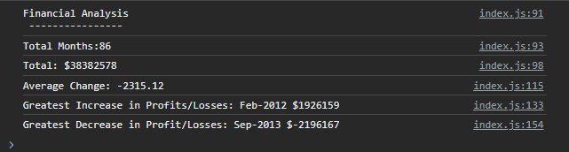

# console-finances

## Description
I have created code for analyzing the financial records of a company using the financial dataset that was provided. The code highlights:
1. The total number of months included in the dataset.

2. The net total amount of Profit/Losses over the entire period.

3. The average of the **changes** in Profit/Losses over the entire period.

4. The greatest increase in Profit/Losses (date and amount) over the entire period.

5. The greatest decrease in Profit/Losses (date and amount) over the entire period.

## Installation
N/A

## Usage
N/A
## Credits
N/A

## License
N/A
